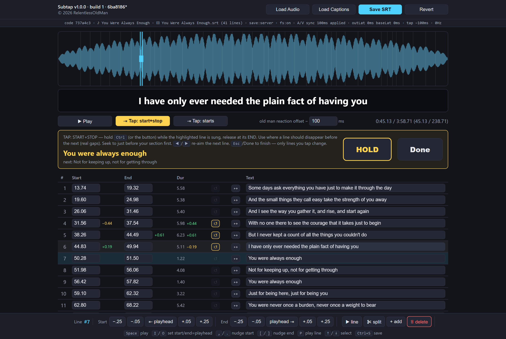

# Subtap 〰️

**Tap your subtitles into time.** A tiny, dependency-free local web app for retiming a song's
`.srt` captions *by ear* — waveform, sample-accurate playback, per-line deltas, and a
DistroKid-style **tap-to-sync** that works on *just a section* of the song instead of forcing you
to do the whole thing in one take.

It's a **single Python file** (~1,000 lines) with **zero required dependencies** beyond the
standard library. No `node_modules`, no build step. Run it and it opens a browser editor that saves
straight back to your `.srt`. (One *optional* extra — `pywebview` — gives it a native
[desktop window](#desktop-window-optional); the browser mode needs nothing installed.)



> *Want to see it populated without loading anything? Run it and visit `http://localhost:8756/?demo=1`.*

## Why

Forced-alignment tools (Whisper, stable-ts, etc.) get you 90% of the way, but reverb, held notes,
and ad-libs throw them off. Subtap is for fixing that last 10% where **your ear is the ground
truth** — nudge a line, or just hold a key and tap the lines into place as the song plays.

## Features

- **Waveform** you can click or drag to scrub (sample-accurate — playback runs through the Web
  Audio API off the decoded buffer, not a flaky `<audio>` element).
- **Tap-sync a chosen section** — arm on the next line, hold a key as each line is sung, and the
  *whole line* drops to where you tap (duration preserved). Two modes: **start+stop** (hold per
  line) and **starts** (one tap per line). Adjustable reaction-time offset.
- **Per-line deltas** — every Start / End / Duration shows exactly how far it moved from the
  original, so you can see what you changed at a glance.
- **One-click revert** per line (lights up only on lines that actually moved).
- **Overlap warnings** — start/end boxes turn red when a line collides with a neighbor.
- **"Now showing"** row highlight tracks the current lyric as it plays.
- **Nudge / snap-to-playhead / drag-edges / split / add / delete**, all keyboard-friendly.
- **Load a plain-lyrics `.txt`** and it spreads the lines evenly across the song, ready to tap
  from scratch.
- **Save TXT** exports the caption text as plain lyrics — and in the desktop app (or when launched
  with a song folder) it restores the **stanza breaks** from the song's own lyric sheet
  (see [Save TXT](#save-txt-plain-lyrics)).
- **Desktop window (optional)** — install `pywebview` and Subtap opens in its own app window
  instead of a browser tab. Its native **Load** dialogs give Subtap the real file path, so it reads
  a picked `.srt`'s sibling lyric sheet directly **and remembers your last audio + captions**,
  silently reloading them next launch (see [Desktop window](#desktop-window-optional)).
- **Remembers your settings** — the tap-sync ("old man") offset and Subtap volume persist across
  sessions in both browser and desktop.
- **Numbered backups** in server mode — every save writes `<name>.srt.bak.NNN` first, so a save
  can never clobber your only copy.

## Requirements

- Python 3.8+
- A modern browser (Chrome/Edge recommended — see [Saving](#saving))
- *Optional:* `pywebview` for the native [desktop window](#desktop-window-optional) (`pip install pywebview`)

## Usage

Just run it and open your files from the browser:

```sh
python subtap.py
```

> **Windows:** double-click **`Subtap.vbs`** for the app window with no console, or **`Subtap.cmd`**
> (it hands off to `pythonw` when pywebview is installed, so no console lingers either way).

Click **Load Audio** (wav / mp3 / m4a / ogg / flac) and **Load Captions** (`.srt`, or a
plain-lyrics `.txt`). Edit, then **Save SRT**.

### Pre-load a folder (optional)

Point it at a folder holding one `.mp3` + one `.srt` and that song loads on launch:

```sh
python subtap.py "path/to/song folder"
python subtap.py "Artist/Song" --port 8756 --no-browser
```

### Desktop window (optional)

By default Subtap runs in your browser. Install `pywebview` and it opens in its own **app window**
instead — same editor, no browser tab:

```sh
pip install pywebview
python subtap.py            # now opens the desktop window (pass --browser to force the browser UI)
```

Why bother? A browser tab is sandboxed — when you open an `.srt` it can only see *that* file, not
its neighbours on disk, so **Save TXT** can't find the sibling lyric sheet for stanza breaks (that's
why folder-launch was the only way to get them). The desktop window's native **Load** dialogs hand
Subtap the **real path**, which unlocks two things:

- **Automatic lyric sheet** — it reads the sibling `<name>.plain.txt` / `<name>.orig.txt` /
  `<name>.txt` on its own, so **Save TXT** restores stanza breaks with no folder launch, no prompt.
- **Save writes back in place** — **Save SRT** overwrites the `.srt` you opened and **Save TXT**
  writes `<name>.plain.txt` next to it, each keeping numbered `.bak.NNN` backups (no downloads).
- **Resume last session** — it remembers the audio + captions you had open (by path, in
  `~/.subtap/session.json`) and silently reloads them next launch. Moved or renamed a file? It's
  quietly skipped. Your tap-sync offset and volume are remembered too (those persist in the browser
  as well).

Chromium-based on Windows (uses the built-in WebView2); the page looks identical.

### Keys

`Space` play · `I`/`O` set start/end to playhead · `,`/`.` nudge start · `[`/`]` nudge end
· `P` play line · `↑`/`↓` select · `◀`/`▶` re-aim the tap pointer · `Ctrl` tap-sync hold · `Ctrl+S` save

## Saving

| Mode | How | Where it saves |
|------|-----|----------------|
| **Desktop app** (pywebview) | native file dialog | **Writes back in place** to the `.srt` you opened, keeping numbered `.srt.bak.NNN` backups. |
| **Pre-loaded folder** | `python subtap.py "<folder>"` | In place, on disk, keeping numbered `.srt.bak.NNN` backups. Works in **any** browser. |
| **Chrome / Edge** (files opened in the UI) | File System Access API | **Writes back to the file you opened.** Refresh even offers to reload your last session. |
| **Firefox / Safari** (files opened in the UI) | download fallback | Downloads the edited `.srt` (those browsers can't write local files). |

The stats bar shows the current mode (`save:write-back` / `save:download`). In the desktop app and
pre-loaded folder, **Save TXT** likewise writes `<name>.plain.txt` next to the `.srt` (with a
`.bak.NNN` backup) instead of downloading.

### Save TXT (plain lyrics)

**Save TXT** exports the caption text as a plain-lyrics `<name>.plain.txt` — one line per cue,
no timings. In the desktop app (or a pre-loaded folder) it writes that file next to the `.srt`
with a `.bak.NNN` backup; from a plain browser tab it downloads. An `.srt` has no place to store
blank lines, so on its own the export is one solid block. But when Subtap can see the song's
**sibling lyric sheet** (`<name>.plain.txt`, else `<name>.orig.txt`/`<name>.txt`, section headers
like `**[Chorus]**` stripped) it overlays *its* **stanza breaks** onto the export. Subtap finds that
sheet in two cases: when you **launch with a song folder**, or when you open the `.srt` through the
[desktop window](#desktop-window-optional)'s native dialog (which gives it the real path on disk).

> **Note:** if that sibling sheet is itself named `<name>.plain.txt`, Save TXT overwrites it — so
> it always makes a `.plain.txt.bak.NNN` backup first.

The breaks are matched to your cues by text — not by line number — so retiming, text fixes, and
even reordered or repeated lines (a chorus) still line up. A line you **added** in Subtap isn't in
the lyric sheet, so it glues to whichever neighbour is closer in time; nudge it if that guessed
wrong. A bare `.srt` opened from a **browser tab** (no folder, no desktop window) can't reach the
lyric sheet, so it exports without breaks — faithful to the `.srt`.

## How it works

A tiny `http.server` serves one HTML page and a few endpoints (`/api/data`, `/api/save`, a
range-request audio stream). The browser does the heavy lifting — decoding the audio into a buffer
for the waveform, playing it back through the Web Audio API, and drawing on a canvas — while Python
just reads/writes the `.srt`. That's the whole architecture, in one file.

Curious? Everything lives in `subtap.py` — the Python server up top, then the whole browser app
inside one `PAGE = r"""..."""` string. Visit `?demo=1` to see it fully populated with no files loaded.

## Layout

```
Subtap/
  subtap.py            the whole thing — server + browser app, one file (stdlib; pywebview optional)
  Subtap.vbs           double-click to run the desktop app with no console (Windows)
  Subtap.cmd           double-click to run it (Windows; detaches to pythonw when pywebview is present)
  release.ps1          one-shot: bump version, tag, cut a GitHub release with subtap.py attached
  docs/screenshot.png  hero image (a posed ?demo=1 render)
  README.md  LICENSE  .gitignore
```

## Contributing

This is a personal tool, published as-is — **issues and pull requests aren't accepted** (PRs
auto-close). Fork it and make it your own. 〰️

## License

MIT — see [LICENSE](LICENSE). © 2026 RelentlessOldMan.
